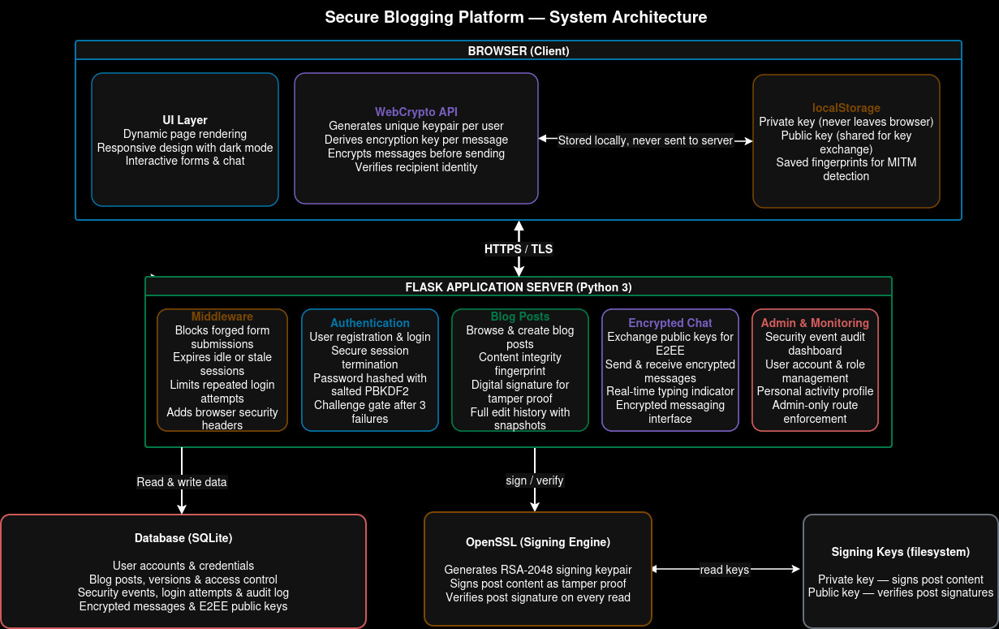

# Secure Blogging Platform (CIA Triad)



This project implements the proposal requirements for a secure blogging platform with CIA triad enforcement, RBAC, and auditability.

## Features

- Confidentiality
- Session-based authentication.
- Password hashing with `PBKDF2-HMAC-SHA256` + per-user random salt.
- HTTPS enforcement support (`ENFORCE_HTTPS=true`) and secure session cookie flags.
- Optional HTTPS local run via `SSL_CERT` and `SSL_KEY` env vars.

- Integrity
- SHA-256 content hash stored per post.
- Hash verification on post read; mismatch is flagged and logged.
- Post version history with hash snapshots.

- Availability
- Brute-force login protection (IP-based rate limiting in 15-minute window).
- Username-based lockout in addition to IP lockout.
- Challenge gate (CAPTCHA-style arithmetic question) after repeated failed logins.
- Input length validation and constrained request size.
- Controlled 403/404/400 handling paths.

- Authentication and Authorization
- Register/login/logout workflows.
- Role-based access control (`admin`, `user`).
- Private/public post visibility and write restrictions.

- Non-repudiation and Monitoring
- Audit logs for registration, login/logout, create/edit/delete, and integrity violations.
- Timestamped log records with source IP.
- RSA digital signatures on post content using local signing keys.

- Common web attack protections
- Parameterized SQL queries (SQL injection mitigation).
- Jinja auto-escaping + safe text handling (XSS mitigation).
- CSRF token enforcement for all form POST actions.

## Stack

- Backend: Flask
- Database: SQLite
- Crypto: `hashlib` / `hmac` (stdlib), `CryptoJS` (Frontend AES-256)

## Run & Setup

# 1. Set the environment variables
export ENFORCE_HTTPS=true
export SSL_CERT=certs/cert.pem
export SSL_KEY=certs/key.pem
# 2. Run the app
python app.py

1. **Extract** the project files.
2. **Create and activate** a virtual environment:
   ```bash
   # Create
   python3 -m venv .venv
   
   # Activate (Linux/Mac)
   source .venv/bin/activate
   # Activate (Windows)
   .venv\Scripts\activate
   ```
3. **Install dependencies**:
   ```bash
   pip install -r requirements.txt
   ```
4. **Start app**:
   ```bash
   python app.py
   ```
   *(Note: Ensure `openssl` is installed on your system for RSA digital signatures.)*

5. **Open**:
   - `http://127.0.0.1:5000`

## Project Structure

- `app.py` - Core application, routes, E2EE logic, and database schema.
- `templates/` - Modern Tailwind CSS HTML templates (supports Light/Dark mode).
- `keys/` - Local directory for RSA signing keys (auto-generated).
- `secure_blog.db` - SQLite database (auto-created).

## Sharing with Teammates (Zip Instructions)

When sharing this project, zip the following:
- `app.py`
- `requirements.txt`
- `README.md`
- `templates/`
- `keys/` (optional)
- `secure_blog.db` (optional)

**Do NOT include**: `.venv/` or `__pycache__/`.

## Proposal Coverage Mapping

- Secure Auth & RBAC: Implemented.
- Public/Private Content with Explicit Access Control: Implemented.
- Hash-based Integrity (SHA-256) & Versioning: Implemented.
- Asymmetric Digital Signatures (RSA) & Verification: Implemented.
- End-to-End Encrypted (E2EE) Chat (AES-256): Implemented.
- Network Attack Simulation (ARP Spoofing): Implemented (`arp_attack.py`).
- Audit Logs & Non-repudiation: Implemented.
- Rate Limiting, Lockout, and Security Challenges: Implemented.
- Content Security Policy (CSP) & HSTS: Implemented.
- Light/Dark Mode Toggle: Implemented.

## Notes

- Use the **VULNERABLE/SECURE** toggle in the chat to demonstrate E2EE vs. Plaintext in Wireshark.
- Use the **Sun/Moon** icon in the navbar to toggle themes.
